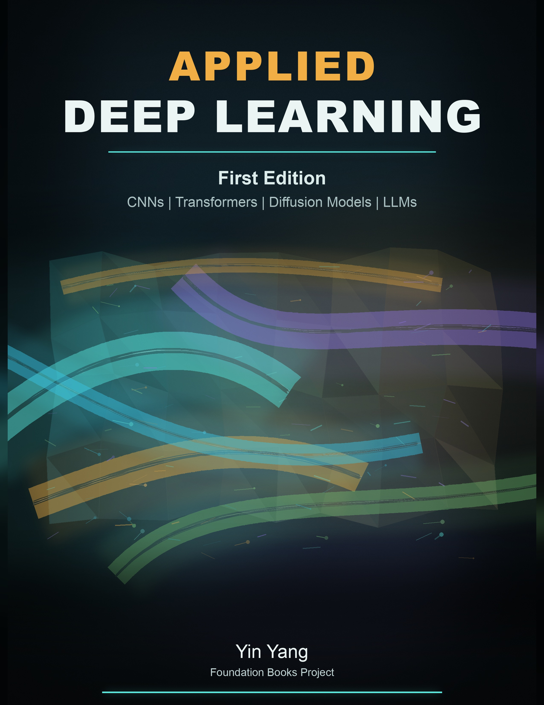

# Applied Deep Learning Companion Code

This repository contains reader-facing code, notebooks, and reference
artifacts for the Applied Deep Learning textbook.



## Book Information

| Field | Details |
| --- | --- |
| Full title | Applied Deep Learning: CNNs, Transformers, Diffusion Models, LLMs |
| Edition | First Edition |
| Author | Yin Yang |
| Publication date | May 1, 2026 |
| Language | English |
| Print length | 589 pages |
| ISBN-13 | 979-8195135201 |
| Amazon ASIN | B0GZF7QRSH |
| Series | Foundation Books |
| Book page | https://www.amazon.com/dp/B0GZF7QRSH |

## Setup

Use Python 3.10, 3.11, or 3.12 with Poetry 2.x:

```sh
poetry install
poetry check --lock
```

After installing dependencies, run chapter commands inside the Poetry
virtualenv. Chapter READMEs often show bare `python`; those examples assume the
Poetry environment is active. Use `poetry env info --path` to locate the
virtualenv.

Run commands from the repository root unless a chapter README says otherwise.
Each chapter directory has its own README with quick checks, data layout, and
full-run guidance.

## Windows Readers

Use WSL2, not native PowerShell or cmd, for the companion-code workflows. The
commands, notebooks, and smoke checks assume a Linux-like shell with tools such
as `make`, `python3`, `/tmp`, shell redirection, and inline environment
variables such as `KERAS_BACKEND=tensorflow`.

Install Python, Poetry, Git, Make, and any package build tools inside the WSL2
Linux distribution. Keep the repository, virtual environment, downloaded
datasets, and generated run artifacts under the WSL filesystem, for example
under `~/applied-deep-learning-code`, instead of running training from
`/mnt/c/...`. Windows-mounted paths can be much slower for dataset-heavy
training and may introduce avoidable file-permission or case-sensitivity
surprises.

WSL2 removes the native-Windows command-line differences, but it does not remove
hardware and package constraints. CPU smoke checks should behave like ordinary
Linux runs after dependencies are installed. CUDA, TensorFlow GPU, PyTorch CUDA,
Unsloth, Qwen ASR/TTS, and vLLM-style workflows still require a compatible
NVIDIA driver, WSL GPU support, and chapter-specific runtime review.

The root `Makefile` contains optional dependency-light smoke checks. The full
smoke check parses Python files without writing bytecode, validates notebooks,
and runs the lightweight chapter checks:

```sh
make smoke-checks
make notebook-check
make vit-code-check
make object-detection-code-check
```

## Notebook Use

Notebook walkthroughs can be opened in Jupyter, VS Code, Colab, or Kaggle. The
shared Poetry groups install the chapter runtimes; they do not pin a notebook
server because many readers use a hosted notebook environment.

For local notebooks, install the relevant chapter dependency group first, then
select the Poetry virtualenv interpreter in your notebook UI. This repository
does not pin a notebook server or `ipykernel`; many readers use an existing
Jupyter, VS Code, Colab, or Kaggle runtime. If your existing local notebook
setup already has `ipykernel` available for the selected Poetry environment,
you can register the kernel with:

```sh
python -m ipykernel install --user --name applied-deep-learning-code --display-name "Applied Deep Learning code"
```

## Companion Coverage

Directory names are descriptive and stable. Use the chapter number column to
map from the book to the companion path.

| Ch. | Book chapter | Companion path | Notebook | Check target |
| --- | --- | --- | --- | --- |
| 1 | Introduction and history | Intentionally no code | None | None |
| 2 | TensorFlow Playground | `chapter_tensorflow_playground/` | Browser lab | None |
| 3 | MNIST Python | `chapter_mnist_python/` | `mnist_keras3_walkthrough.ipynb` | `make mnist-code-check` |
| 4 | CNN basics | `chapter_cnn_basics/` | `cifar10_keras3_walkthrough.ipynb` | `make cnn-code-check` |
| 5 | Neural network training | `chapter_neural_network_training/` | `cifar10_training_lab.ipynb` | `make neural-network-training-code-check` |
| 6 | CNN architectures | `chapter_cnn_architectures/` | `resnet_cifar10_walkthrough.ipynb` | `make cnn-arch-code-check` |
| 7 | Transfer learning | `chapter_transfer_learning_fastai/` | `food101_fastai_walkthrough.ipynb` | `make transfer-learning-code-check` |
| 8 | Embeddings | `chapter_embeddings/` | `kaggle_bag_of_embeddings_sentiment_walkthrough.ipynb` | `make embeddings-code-check` |
| 9 | Recurrent neural networks | `chapter_recurrent_neural_networks/` | `imdb_rnn_keras3_walkthrough.ipynb` | `make rnn-code-check` |
| 10 | Attention and Transformers | `chapter_attention_transformers/` | `attention_transformers_walkthrough.ipynb` | `make attention-transformers-code-check` |
| 11 | From Transformer to LLMs | `chapter_from_transformer_to_llms/` | `llm_prompt_benchmark_walkthrough.ipynb` | `make llm-code-check` |
| 12 | Retrieval-augmented generation | `chapter_retrieval_augmented_generation/` | `rag_course_assistant_walkthrough.ipynb` | `make rag-code-check` |
| 13 | LoRA and QLoRA adaptation | `chapter_lora_qlora_adaptation/` | `lora_unsloth_course_assistant_walkthrough.ipynb` | `make lora-code-check` |
| 14 | Reinforcement learning intro | `chapter_reinforcement_learning_intro/` | `rl_intro_walkthrough.ipynb` | `make rl-intro-code-check` |
| 15 | RL for LLM training | `chapter_reinforcement_learning_llm_training/` | `rl_lora_unsloth_reasoning_walkthrough.ipynb` | `make rl-llm-code-check` |
| 16 | Neural network training revisited | `chapter_neural_network_training_revisited/` | `transformer_distillation_walkthrough.ipynb` | `make nnt-revisited-code-check` |
| 17 | Vision Transformers | `chapter_vision_transformers/` | `pretrained_vit_walkthrough.ipynb` | `make vit-code-check` |
| 18 | CNNs revisited | `chapter_cnn_revisited/` | `convnext_food101_walkthrough.ipynb` | `make cnn-revisited-code-check` |
| 19 | Vision-language models | `chapter_vision_language_models/` | `vlm_reasoning_walkthrough.ipynb` | `make vlm-code-check` |
| 20 | Object detection | `chapter_object_detection/` | `yolo_medical_detection_walkthrough.ipynb` | `make object-detection-code-check` |
| 21 | Segmentation | `chapter_segmentation_cnn_transformers/` | `segmentation_medical_walkthrough.ipynb` | `make segmentation-code-check` |
| 22 | Image generation | `chapter_image_generation/` | `image_generation_walkthrough.ipynb` | `make image-generation-code-check` |
| 23 | Automatic speech recognition | `chapter_automatic_speech_recognition/` | `asr_transcription_walkthrough.ipynb` | `make asr-code-check` |
| 24 | Text-to-speech | `chapter_text_to_speech/` | `tts_voice_cloning_walkthrough.ipynb` | `make tts-code-check` |
| 25 | Advanced topics | Intentionally no code | None | None |
| 26 | Future work | Intentionally no code | None | None |

## Dependency Groups

- `keras-tensorflow`, `keras-torch`, `keras-jax`: Keras chapter backends.
- `pytorch`, `figures`: PyTorch examples and plotting.
- `transfer-learning`, `embeddings`, `attention-transformers`,
  `vision-transformers`: chapter-specific vision and NLP stacks.
- `image-generation`, `rl-intro`, `nnt-revisited`, `rag-neural`, `llm`,
  `lora`, `rl-llm`, `asr`, `tts`, `object-detection`, `segmentation`, `vlm`:
  later-chapter and optional runtime stacks.

Some specialized packages are intentionally not pinned in the shared Poetry
lock because their supported versions depend on the active GPU runtime or model
provider. Examples include `qwen_asr`, `qwen_tts`, and the current Unsloth
installation path. The chapter READMEs call these out explicitly.

## Device Support

Reader-facing PyTorch examples prefer CUDA when it is available, then Apple MPS
on supported Macs, then CPU. MPS support is included where the chapter workflow
uses ordinary PyTorch tensor and module placement, such as smaller vision,
benchmarking, reinforcement-learning, image-generation quick runs, segmentation,
and neural retrieval examples.

Advanced workflows that rely on CUDA-specific kernels, memory accounting,
quantization, device maps, or third-party GPU runtimes may still require NVIDIA
GPUs or fall back to CPU. This includes Unsloth training, some Qwen ASR/TTS
paths, and larger LLM or VLM generation runs. If a Mac run hits an unsupported
MPS operation, retry with `--device cpu` or the chapter's CPU option.

PyTorch groups use the public PyPI packages. On Linux, those packages may bring
CUDA/NVIDIA runtime dependencies even when you plan to run on CPU. For a
strict CPU-only PyTorch environment, follow the official PyTorch CPU wheel
instructions in a separate reviewed environment, then keep the generated
version and hardware metadata with your run artifacts.

For Windows readers using WSL2, treat GPU setup as Linux-in-WSL setup rather
than native Windows setup. Verify the WSL distribution can see the NVIDIA GPU
before starting GPU chapters, then record the driver, CUDA, PyTorch, TensorFlow,
and provider-package versions with any reported run artifacts.

## Data, Artifacts, And Safety

Do not commit `.env` files. If a workflow uses an external API, `.env` should
contain only secrets such as API keys. Keep prompts, manifests, generated
outputs, scores, downloaded datasets, local audio, checkpoints, and run metadata
in ignored data or artifact directories.

Small CSV, JSON, and PNG artifacts under `reference_artifacts/` mirror evidence
used by the textbook. They are included so readers can inspect table inputs and
plot records without rerunning long GPU jobs. Raw third-party dataset text is
redacted from public reference artifacts when redistribution terms are unclear.

This repository does not bundle large datasets, model weights, DICOM files, or
audio corpora. Download datasets from their original providers and follow their
license and attribution terms. Scripts keep remote model code execution opt-in;
pass `--trust-remote-code` only after reviewing the selected model repository.
